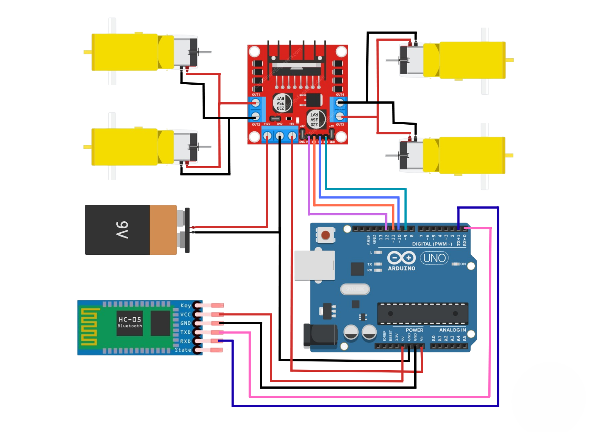

# 🚗 Bluetooth Controlled RC Car (Arduino + HC-05 + L298N)

An Arduino-based **Bluetooth controlled RC car** using the HC-05 Bluetooth module, L298N motor driver, and DC motors powered by a lithium battery pack.  
Control the car wirelessly from your smartphone using simple commands.  

---

## 📌 Overview

- **Objective**: Build a DIY Bluetooth-controlled car using Arduino.  
- **Control**: Smartphone sends commands (`F`, `B`, `L`, `R`, `S`) via Bluetooth.  
- **Motors**: Two DC motors controlled with an L298N H-bridge driver.  
- **Power**: Lithium-ion battery pack powers Arduino + motors.  
- **Range**: Limited by Bluetooth (~10 meters).  

---

## 🛠️ Hardware Requirements

| Component | Quantity | Purpose |
|-----------|----------|---------|
| Arduino Uno (or compatible) | 1 | Main microcontroller |
| HC-05 Bluetooth module | 1 | Wireless communication |
| L298N Motor Driver | 1 | Motor control |
| DC motors with wheels | 2 | Drive system |
| Chassis / frame | 1 | Car body |
| Lithium-ion battery | 1 | Power supply |
| Jumper wires | — | Connections |
| Breadboard / mounting board | 1 | Assembly base |

---

## 💻 Software Requirements

- **Arduino IDE** (or PlatformIO)  
- Built-in libraries only (`Serial` + `digitalWrite`)  

---

## ⚡ Circuit Diagram

Below is the wiring diagram for the RC car setup:  

